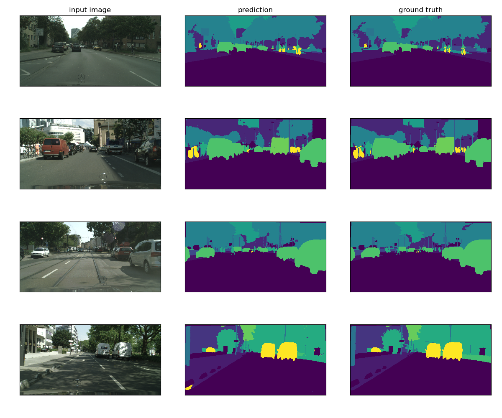

# PytorchSegmentation
This repository implements general network for semantic segmentation.  
You can train various networks like DeepLabV3+, PSPNet, UNet, etc., just by writing the config file.



## Pretrained model
You can run pretrained model converted from [official tensorflow model](https://github.com/tensorflow/models/blob/master/research/deeplab/g3doc/model_zoo.md).  

### DeepLabV3+(Xception65+ASPP)
```
$ cd tf_model
$ wget http://download.tensorflow.org/models/deeplabv3_cityscapes_train_2018_02_06.tar.gz
$ tar -xvf deeplabv3_cityscapes_train_2018_02_06.tar.gz
$ cd ../src
$ python -m converter.convert_xception65 ../tf_model/deeplabv3_cityscapes_train/model.ckpt 19 ../model/cityscapes_deeplab_v3_plus/model.pth
```

Then you can test the performance of trained network.

```
$ python eval_cityscapes.py --tta
```

mIoU of cityscapes
```
$ pip install cityscapesScripts
$ export CITYSCAPES_RESULTS=../output/cityscapes_val/cityscapes_deeplab_v3_plus_tta
$ export CITYSCAPES_DATASET=../data/cityscapes
$ csEvalPixelLevelSemanticLabeling 
```

```
classes          IoU      nIoU
--------------------------------
road          : 0.984      nan
sidewalk      : 0.866      nan
building      : 0.931      nan
wall          : 0.626      nan
fence         : 0.635      nan
pole          : 0.668      nan
traffic light : 0.698      nan
traffic sign  : 0.800      nan
vegetation    : 0.929      nan
terrain       : 0.651      nan
sky           : 0.954      nan
person        : 0.832    0.645
rider         : 0.644    0.452
car           : 0.956    0.887
truck         : 0.869    0.420
bus           : 0.906    0.657
train         : 0.834    0.555
motorcycle    : 0.674    0.404
bicycle       : 0.783    0.605
--------------------------------
Score Average : 0.802    0.578
--------------------------------


categories       IoU      nIoU
--------------------------------
flat          : 0.988      nan
construction  : 0.937      nan
object        : 0.729      nan
nature        : 0.931      nan
sky           : 0.954      nan
human         : 0.842    0.667
vehicle       : 0.944    0.859
--------------------------------
Score Average : 0.904    0.763
--------------------------------
```

### MobilenetV2
```
$ cd tf_model
$ wget http://download.tensorflow.org/models/deeplabv3_mnv2_cityscapes_train_2018_02_05.tar.gz
$ tar -xvf deeplabv3_mnv2_cityscapes_train_2018_02_05.tar.gz
$ cd ../src
$ python -m converter.convert_mobilenetv2 ../tf_model/deeplabv3_mnv2_cityscapes_train/model.ckpt 19 ../model/cityscapes_mobilnetv2/model.pth
```


## How to train
In order to train model, you have only to setup config file.  
For example, write config file as below and save it as config/pascal_unet_res18_scse.yaml.

```yaml
Net:
  enc_type: 'resnet18'
  dec_type: 'unet_scse'
  num_filters: 8
  pretrained: True
Data:
  dataset: 'pascal'
  target_size: (512, 512)
Train:
  max_epoch: 20
  batch_size: 2
  fp16: True
  resume: False
  pretrained_path:
Loss:
  loss_type: 'Lovasz'
  ignore_index: 255
Optimizer:
  mode: 'adam'
  base_lr: 0.001
  t_max: 10
```

Then you can train this model by:

```
$ python train.py ../config/pascal_unet_res18_scse.yaml
```

## Dataset
- Cityscapes
- Pascal Voc
    - augmentation
        - http://home.bharathh.info/pubs/codes/SBD/download.html
        - https://github.com/TheLegendAli/DeepLab-Context/issues/10

## Directory tree
```
.
├── config
├── data
│   ├── cityscapes
│   │   ├── gtFine
│   │   └── leftImg8bit
│   └── pascal_voc_2012
│        └── VOCdevkit
│            └── VOC2012
│                ├── JPEGImages
│                ├── SegmentationClass
│                └── SegmentationClassAug
├── logs
├── model
└── src
    ├── dataset
    ├── logger
    ├── losses
    │   ├── binary
    │   └── multi
    ├── models
    └── utils
```

## Environments
- OS: Ubuntu18.04
- python: 3.7.0
- pytorch: 1.0.0
- pretrainedmodels: 0.7.4
- albumentations: 0.1.8  

if you want to train models in fp16
- NVIDIA/apex: 0.1

## Reference

### Encoder
- https://arxiv.org/abs/1505.04597
- https://github.com/tugstugi/pytorch-saltnet

### Decoder
#### SCSE
- https://arxiv.org/abs/1803.02579

#### IBN
- https://arxiv.org/abs/1807.09441
- https://github.com/XingangPan/IBN-Net
- https://github.com/SeuTao/Kaggle_TGS2018_4th_solution

#### OC
- https://arxiv.org/abs/1809.00916
- https://github.com/PkuRainBow/OCNet

#### PSP
- https://arxiv.org/abs/1612.01105

#### ASPP
- https://arxiv.org/abs/1802.02611
